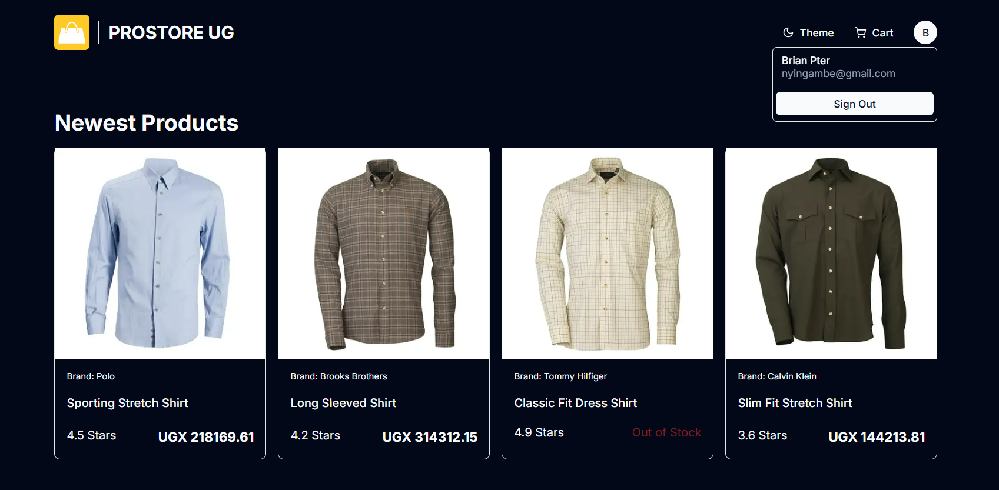
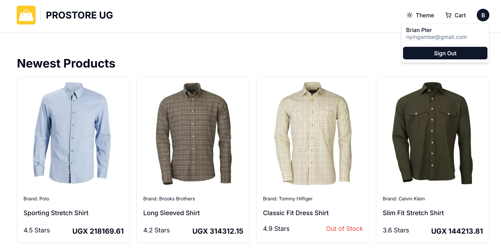
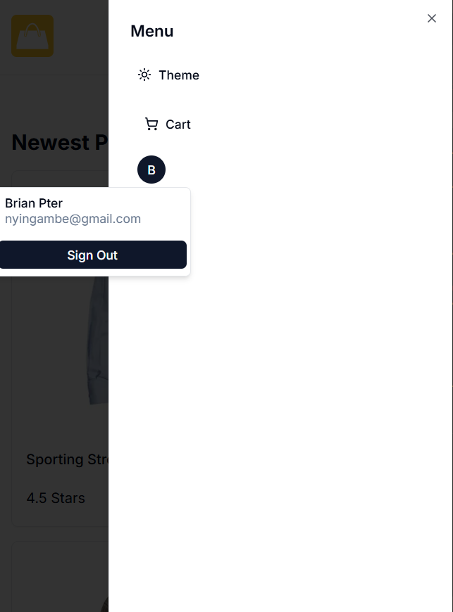

**Prostore UG**

 

**Prostore UG** is a comprehensive e-commerce platform developed using Next.js, TypeScript, PostgreSQL, and Prisma. It offers a wide range of features designed to provide a seamless shopping experience for users and robust management tools for administrators.

Key Features:

Authentication: Utilizes NextAuth for secure user authentication.

Admin Dashboard: Includes an admin area equipped with statistics and charts powered by Recharts, facilitating effective management of orders, products, and users.

User Profile: Provides a user area where customers can manage their profiles and view their orders.

Payment Integration: Supports multiple payment options, including Stripe API integration, PayPal integration, and a cash-on-delivery option.

Checkout Process: Features an interactive checkout process to enhance user experience.

Product Display: Showcases featured products with banners and supports multiple images using Uploadthing.

Reviews and Ratings: Incorporates a ratings and reviews system to facilitate customer feedback.

Search and Filtering: Equipped with search functionality for both customers and admins, along with sorting, filtering, and pagination capabilities.

Theme Options: Offers system (automatic), dark and light mode themes to suit user preferences.

Please visit here to try it out: https://prostore-orpin.vercel.app/
